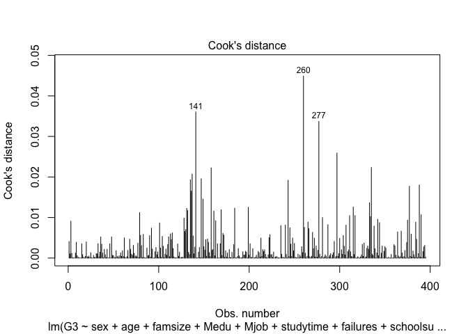
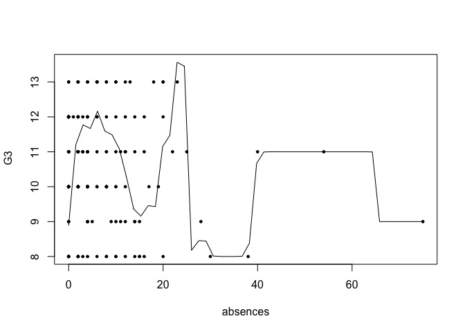
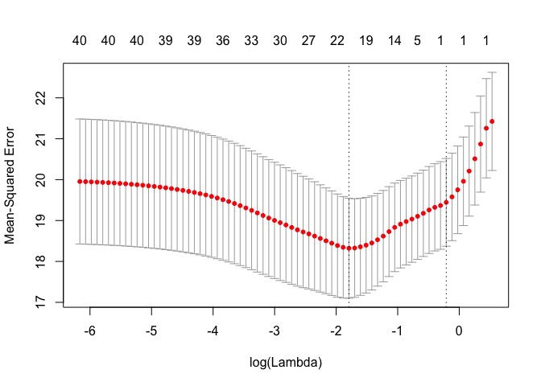
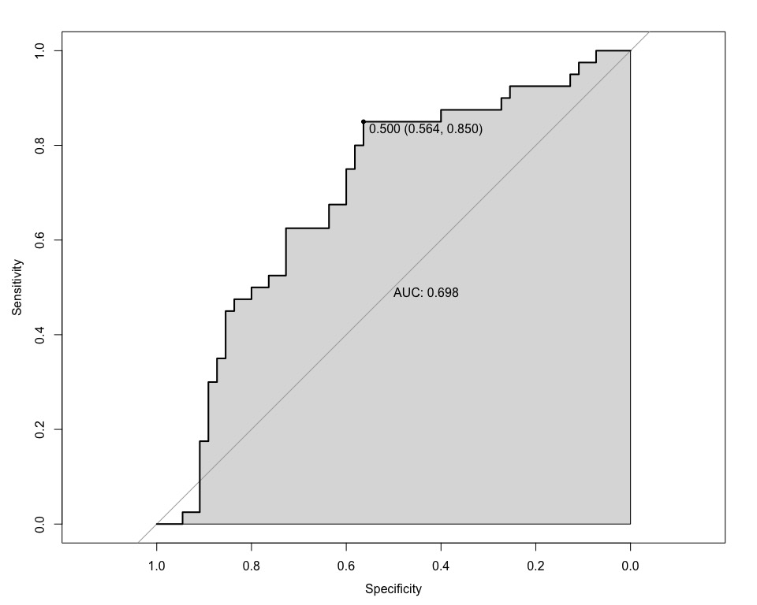

Homework2
================
Mykola Pavlov
5/9/2017

-   [Problem 3: Regression analysis - artificial data](#problem-3-regression-analysis---artificial-data)
-   [Problem 4: Linear regression analysis - real data](#problem-4-linear-regression-analysis---real-data)
-   [Problem 5: Regression techniques](#problem-5-regression-techniques)

Problem 3: Regression analysis - artificial data
------------------------------------------------

### Task 1

``` r
generate_mv <- function(size, means, p) {
  mvrnorm(size, means, toeplitz(c(1, p, p)))
}

set.seed(42)
n = 200
p <- .3
mu <- c(10, 100, 1000)
smp <- generate_mv(n, mu, p)
```

### Task 2

``` r
generate_depend <- function(samples, betas) {
  size <- dim(samples)[1]
  data <- cbind(rep(1, size), smp)
  y <- data %*% betas + rnorm(size)
  bind_cols(data.frame(samples), data.frame(y = y))
}


set.seed(777)
b <- matrix(c(1, .1, .01, .001))
df <- generate_depend(smp, b)
```

### Task 3

``` r
fit3_small <- lm(y ~., df)
summary(fit3_small)
```

    ## 
    ## Call:
    ## lm(formula = y ~ ., data = df)
    ## 
    ## Residuals:
    ##      Min       1Q   Median       3Q      Max 
    ## -2.97370 -0.57368 -0.01818  0.66882  2.70533 
    ## 
    ## Coefficients:
    ##              Estimate Std. Error t value Pr(>|t|)  
    ## (Intercept)  1.595311  76.115639   0.021   0.9833  
    ## X1          -0.087690   0.077331  -1.134   0.2582  
    ## X2           0.130572   0.075970   1.719   0.0872 .
    ## X3          -0.009779   0.076888  -0.127   0.8989  
    ## ---
    ## Signif. codes:  0 '***' 0.001 '**' 0.01 '*' 0.05 '.' 0.1 ' ' 1
    ## 
    ## Residual standard error: 0.9881 on 196 degrees of freedom
    ## Multiple R-squared:  0.01807,    Adjusted R-squared:  0.003045 
    ## F-statistic: 1.203 on 3 and 196 DF,  p-value: 0.31

Non of the estimates of the true parameter values are statistically significant for alpha = 0.05. Adjusted R-squared of the model is 0.003045.

### Task 4

``` r
n <- 2000
set.seed(7)
smp <- generate_mv(n, mu, p)
df <- generate_depend(smp, b)
fit3_big <- lm(y ~., df)
summary(fit3_big)
```

    ## 
    ## Call:
    ## lm(formula = y ~ ., data = df)
    ## 
    ## Residuals:
    ##     Min      1Q  Median      3Q     Max 
    ## -3.6718 -0.6848 -0.0033  0.6845  3.7337 
    ## 
    ## Coefficients:
    ##             Estimate Std. Error t value Pr(>|t|)   
    ## (Intercept) 24.02480   24.46857   0.982  0.32629   
    ## X1           0.07604    0.02462   3.089  0.00203 **
    ## X2           0.05400    0.02454   2.200  0.02792 * 
    ## X3          -0.02616    0.02492  -1.050  0.29388   
    ## ---
    ## Signif. codes:  0 '***' 0.001 '**' 0.01 '*' 0.05 '.' 0.1 ' ' 1
    ## 
    ## Residual standard error: 1.025 on 1996 degrees of freedom
    ## Multiple R-squared:  0.009253,   Adjusted R-squared:  0.007764 
    ## F-statistic: 6.214 on 3 and 1996 DF,  p-value: 0.000337

The estimates for X1 and X2 are now statistically significant, their true values are 0.1, 0.01 vs the estimated 0.07, 0.05. The standard errors of the variables were reduced by approximately three times.

### Task 5

``` r
p <- .8
n <- 200
set.seed(777)
smp <- generate_mv(n, mu, p)
df <- generate_depend(smp, b)
fit8_small <- lm(y ~., df)
summary(fit8_small)
```

    ## 
    ## Call:
    ## lm(formula = y ~ ., data = df)
    ## 
    ## Residuals:
    ##     Min      1Q  Median      3Q     Max 
    ## -2.7992 -0.6967 -0.0425  0.6976  3.3693 
    ## 
    ## Coefficients:
    ##             Estimate Std. Error t value Pr(>|t|)  
    ## (Intercept)  47.1223   123.4054   0.382   0.7030  
    ## X1            0.2369     0.1387   1.708   0.0892 .
    ## X2           -0.1995     0.1363  -1.464   0.1449  
    ## X3           -0.0256     0.1279  -0.200   0.8416  
    ## ---
    ## Signif. codes:  0 '***' 0.001 '**' 0.01 '*' 0.05 '.' 0.1 ' ' 1
    ## 
    ## Residual standard error: 1.033 on 196 degrees of freedom
    ## Multiple R-squared:  0.01738,    Adjusted R-squared:  0.002335 
    ## F-statistic: 1.155 on 3 and 196 DF,  p-value: 0.3281

The estimates of the true parameter values are not statistically significant. Adjusted R-squared of the model is only 0.002335. The standard errors are nearly twice bigger then for p = 0.3.

### Task 6

It's assumed that parameter estimates of our models are normally distributed, so we can compute the confidence intervals using the standard normal distribution with appropriate standard error. As you can see below (and it's expected) the larger samples have lower standard error and narrower confidence intervals, that include the true value of the parameters.

``` r
confint(fit3_small)
```

    ##                     2.5 %       97.5 %
    ## (Intercept) -148.51547751 151.70610006
    ## X1            -0.24019830   0.06481814
    ## X2            -0.01925115   0.28039465
    ## X3            -0.16141202   0.14185478

``` r
confint(fit8_small)
```

    ##                     2.5 %       97.5 %
    ## (Intercept) -196.25052542 290.49517155
    ## X1            -0.03658781   0.51048831
    ## X2            -0.46822847   0.06928383
    ## X3            -0.27791853   0.22671966

``` r
confint(fit3_big)
```

    ##                     2.5 %     97.5 %
    ## (Intercept) -23.961819135 72.0114239
    ## X1            0.027767315  0.1243188
    ## X2            0.005861691  0.1021337
    ## X3           -0.075038127  0.0227087

### Task 7

One of the approach we can choose is to mesure the change in R-squared that each variable produces when it is added to a model that already contains all of the other variables. Another way is to directly compare t-statistics of the parameters, since they are based on standartized values.

### Task 8

``` r
p <- .1
n <- 200
set.seed(777)
smp <- generate_mv(n, mu, p)
df <- generate_depend(smp, b)
fit1_two_vars <- lm(y ~ X1 + X2, df)
summary(fit1_two_vars)
```

    ## 
    ## Call:
    ## lm(formula = y ~ X1 + X2, data = df)
    ## 
    ## Residuals:
    ##     Min      1Q  Median      3Q     Max 
    ## -2.8387 -0.7038 -0.0798  0.7130  3.3683 
    ## 
    ## Coefficients:
    ##             Estimate Std. Error t value Pr(>|t|)   
    ## (Intercept)  3.82138    6.86631   0.557  0.57847   
    ## X1           0.23110    0.07930   2.914  0.00398 **
    ## X2          -0.02187    0.06941  -0.315  0.75307   
    ## ---
    ## Signif. codes:  0 '***' 0.001 '**' 0.01 '*' 0.05 '.' 0.1 ' ' 1
    ## 
    ## Residual standard error: 1.032 on 197 degrees of freedom
    ## Multiple R-squared:  0.04139,    Adjusted R-squared:  0.03165 
    ## F-statistic: 4.253 on 2 and 197 DF,  p-value: 0.01556

``` r
p <- .8
n <- 200
set.seed(42)
smp <- generate_mv(n, mu, p)
df <- generate_depend(smp, b)
fit8_two_vars <- lm(y ~ X1 + X2, df)
summary(fit8_two_vars)
```

    ## 
    ## Call:
    ## lm(formula = y ~ X1 + X2, data = df)
    ## 
    ## Residuals:
    ##     Min      1Q  Median      3Q     Max 
    ## -2.9206 -0.6141  0.0329  0.7176  2.2766 
    ## 
    ## Coefficients:
    ##             Estimate Std. Error t value Pr(>|t|)
    ## (Intercept) -2.43317   10.20149  -0.239    0.812
    ## X1           0.12025    0.10355   1.161    0.247
    ## X2           0.05101    0.10975   0.465    0.643
    ## 
    ## Residual standard error: 0.9321 on 197 degrees of freedom
    ## Multiple R-squared:  0.02914,    Adjusted R-squared:  0.01929 
    ## F-statistic: 2.957 on 2 and 197 DF,  p-value: 0.0543

In both cases the standard error for the b0 estimate have been reduced significantly as well as for b1 and b2. It's a consequence of the bias-variance tradeoff: the less number of independent variables in the model leads to lower variance at the cost of potential bias.

Problem 4: Linear regression analysis - real data
-------------------------------------------------

### Task 1

``` r
set.seed(42)
fit_math <- lm(G3 ~ ., df)
summary(fit_math)
```

    ## 
    ## Call:
    ## lm(formula = G3 ~ ., data = df)
    ## 
    ## Residuals:
    ##      Min       1Q   Median       3Q      Max 
    ## -13.0442  -1.9028   0.4289   2.7570   8.8874 
    ## 
    ## Coefficients:
    ##                  Estimate Std. Error t value Pr(>|t|)    
    ## (Intercept)      14.07769    4.48089   3.142  0.00182 ** 
    ## schoolMS          0.72555    0.79157   0.917  0.35997    
    ## sexM              1.26236    0.50003   2.525  0.01202 *  
    ## age              -0.37516    0.21721  -1.727  0.08501 .  
    ## addressU          0.55135    0.58412   0.944  0.34586    
    ## famsizeLE3        0.70281    0.48824   1.439  0.15090    
    ## PstatusT         -0.32010    0.72390  -0.442  0.65862    
    ## Medu              0.45687    0.32317   1.414  0.15833    
    ## Fedu             -0.10458    0.27762  -0.377  0.70663    
    ## Mjobhealth        0.99808    1.11819   0.893  0.37268    
    ## Mjobother        -0.35900    0.71316  -0.503  0.61500    
    ## Mjobservices      0.65832    0.79784   0.825  0.40985    
    ## Mjobteacher      -1.24149    1.03821  -1.196  0.23257    
    ## Fjobhealth        0.34767    1.43796   0.242  0.80909    
    ## Fjobother        -0.61967    1.02304  -0.606  0.54509    
    ## Fjobservices     -0.46577    1.05697  -0.441  0.65972    
    ## Fjobteacher       1.32619    1.29654   1.023  0.30707    
    ## reasonhome        0.07851    0.55380   0.142  0.88735    
    ## reasonother       0.77707    0.81757   0.950  0.34252    
    ## reasonreputation  0.61304    0.57657   1.063  0.28839    
    ## guardianmother    0.06978    0.54560   0.128  0.89830    
    ## guardianother     0.75010    0.99946   0.751  0.45345    
    ## traveltime       -0.24027    0.33897  -0.709  0.47889    
    ## studytime         0.54952    0.28765   1.910  0.05690 .  
    ## failures         -1.72398    0.33291  -5.179 3.75e-07 ***
    ## schoolsupyes     -1.35058    0.66693  -2.025  0.04361 *  
    ## famsupyes        -0.86182    0.47869  -1.800  0.07265 .  
    ## paidyes           0.33975    0.47775   0.711  0.47746    
    ## activitiesyes    -0.32953    0.44494  -0.741  0.45942    
    ## nurseryyes       -0.17730    0.54931  -0.323  0.74706    
    ## higheryes         1.37045    1.07780   1.272  0.20437    
    ## internetyes       0.49813    0.61956   0.804  0.42192    
    ## romanticyes      -1.09449    0.46925  -2.332  0.02024 *  
    ## famrel            0.23155    0.24593   0.942  0.34706    
    ## freetime          0.30242    0.23735   1.274  0.20345    
    ## goout            -0.59367    0.22451  -2.644  0.00855 ** 
    ## Dalc             -0.27223    0.33087  -0.823  0.41120    
    ## Walc              0.26339    0.24801   1.062  0.28896    
    ## health           -0.17678    0.16101  -1.098  0.27297    
    ## absences          0.05629    0.02897   1.943  0.05277 .  
    ## ---
    ## Signif. codes:  0 '***' 0.001 '**' 0.01 '*' 0.05 '.' 0.1 ' ' 1
    ## 
    ## Residual standard error: 4.108 on 355 degrees of freedom
    ## Multiple R-squared:  0.2756, Adjusted R-squared:  0.196 
    ## F-statistic: 3.463 on 39 and 355 DF,  p-value: 3.317e-10

For every categorical variable R creates additional dummy variables using one-hot encoding procedure. Every column encodes the presence (or absence) of the specific category level in the sample (in terms of indicator function). For example, if `Mjobhealth` column contains 1 it means that mother's job is realted to healthcare for this particular student. When all variables are encoded properly, R fits the logistic model to this modified data set.

### Task 2

Let's test the following hypothesis:

-   H0: Mjobhealth = Mjobother = Mjobservices = Mjobteacher = 0
-   HA: At least one of Mjob's is not equal to 0

``` r
glh_test <- linearHypothesis(fit_math, c(
  "Mjobhealth = 0",
  "Mjobother = 0",
  "Mjobservices = 0",
  "Mjobteacher = 0"
))

glh_test
```

    ## Linear hypothesis test
    ## 
    ## Hypothesis:
    ## Mjobhealth = 0
    ## Mjobother = 0
    ## Mjobservices = 0
    ## Mjobteacher = 0
    ## 
    ## Model 1: restricted model
    ## Model 2: G3 ~ school + sex + age + address + famsize + Pstatus + Medu + 
    ##     Fedu + Mjob + Fjob + reason + guardian + traveltime + studytime + 
    ##     failures + schoolsup + famsup + paid + activities + nursery + 
    ##     higher + internet + romantic + famrel + freetime + goout + 
    ##     Dalc + Walc + health + absences
    ## 
    ##   Res.Df    RSS Df Sum of Sq      F  Pr(>F)  
    ## 1    359 6154.4                              
    ## 2    355 5990.8  4    163.56 2.4231 0.04794 *
    ## ---
    ## Signif. codes:  0 '***' 0.001 '**' 0.01 '*' 0.05 '.' 0.1 ' ' 1

It looks like we have to reject the null hypothesis for alpha = 0.05.

### Task 3

No, because by default R treats goout as numeric. It should be converted to ordinal factor first.

### Task 4

Student achievements are influenced by different factors: school related, demographic and social. According to the fitted linear model:

-   number of school absences has low correlation with G3, on average when absence gorws by one unit G3 grows on 0.05629 (assuming that other parameters are fixed)
-   time spent with friends has negative correlation with G3, on average when time spent with friends drops by one unit G3 grows on 0.59 (assuming that other parameters are fixed)
-   mother's occupation has different correlations with student's G3: on average the difference in G3 if mother has a health related job is 0.99808, service - 0.65832, teacher - -1.24149, other - -0.35900 (everytime assuming that other parameters are fixed).

### Task 5

``` r
intervals <- confint(fit_math)
intervals[rownames(intervals) == "absences", ]
```

    ##        2.5 %       97.5 % 
    ## -0.000675997  0.113258940

We are 95% confident the true difference in G3 is in the interval between -0.0008 and 0.11 for every school absence given that all other parameters are fixed. Since the value goes over zero, it's not a statistically significant estimate.

### Task 6

``` r
fit_math_reduced <- stepAIC(fit_math, trace = F)
summary(fit_math_reduced)
```

    ## 
    ## Call:
    ## lm(formula = G3 ~ sex + age + famsize + Medu + Mjob + studytime + 
    ##     failures + schoolsup + famsup + romantic + freetime + goout + 
    ##     absences, data = df)
    ## 
    ## Residuals:
    ##      Min       1Q   Median       3Q      Max 
    ## -13.5100  -1.6786   0.3531   2.8716   8.8976 
    ## 
    ## Coefficients:
    ##              Estimate Std. Error t value Pr(>|t|)    
    ## (Intercept)  13.67213    3.24697   4.211 3.18e-05 ***
    ## sexM          0.96171    0.46086   2.087  0.03758 *  
    ## age          -0.28634    0.18073  -1.584  0.11395    
    ## famsizeLE3    0.72802    0.46407   1.569  0.11754    
    ## Medu          0.55202    0.25917   2.130  0.03382 *  
    ## Mjobhealth    1.47081    1.01230   1.453  0.14707    
    ## Mjobother    -0.18623    0.66215  -0.281  0.77867    
    ## Mjobservices  0.97452    0.73506   1.326  0.18572    
    ## Mjobteacher  -0.84531    0.96459  -0.876  0.38140    
    ## studytime     0.57107    0.26533   2.152  0.03200 *  
    ## failures     -1.86045    0.30247  -6.151 1.96e-09 ***
    ## schoolsupyes -1.27767    0.65077  -1.963  0.05034 .  
    ## famsupyes    -0.82144    0.44547  -1.844  0.06597 .  
    ## romanticyes  -1.09244    0.45302  -2.411  0.01636 *  
    ## freetime      0.31303    0.22300   1.404  0.16122    
    ## goout        -0.54499    0.19661  -2.772  0.00585 ** 
    ## absences      0.05688    0.02701   2.106  0.03587 *  
    ## ---
    ## Signif. codes:  0 '***' 0.001 '**' 0.01 '*' 0.05 '.' 0.1 ' ' 1
    ## 
    ## Residual standard error: 4.075 on 378 degrees of freedom
    ## Multiple R-squared:  0.2408, Adjusted R-squared:  0.2087 
    ## F-statistic: 7.494 on 16 and 378 DF,  p-value: 2.549e-15

### Task 7

``` r
plot(fit_math_reduced, which=4, cook.levels=cutoff)
```



Samples 141, 260, and 277 appears to be the most influential.

### Task 8

Since the absence variable is numeric, we can impute a missing value by taking an average over all other samples where it presented. In case of the higher variable we can create a logistic regression model with all other variables as predictors and predict missing yes/no values.

### Task 9

The homoscedasticity assumption of the fitted model is violated here.

### Task 11

``` r
set.seed(777)
smp <- sample.int(nrow(df), 300)
train <- df[smp, ]
test <- df[-smp, ]
fit_math_model <- lm(G3 ~ ., train)
fit_math_best <- stepAIC(fit_math_model, trace = F)
summary(fit_math_best)
```

    ## 
    ## Call:
    ## lm(formula = G3 ~ sex + Mjob + studytime + failures + schoolsup + 
    ##     famsup + higher + goout + health + absences, data = train)
    ## 
    ## Residuals:
    ##      Min       1Q   Median       3Q      Max 
    ## -12.2590  -2.0246   0.4231   2.6556   8.4017 
    ## 
    ## Coefficients:
    ##              Estimate Std. Error t value Pr(>|t|)    
    ## (Intercept)   9.50679    1.65414   5.747 2.32e-08 ***
    ## sexM          1.52079    0.52909   2.874  0.00435 ** 
    ## Mjobhealth    3.21770    1.01749   3.162  0.00173 ** 
    ## Mjobother     0.16377    0.75896   0.216  0.82931    
    ## Mjobservices  2.01367    0.80337   2.507  0.01275 *  
    ## Mjobteacher   0.29533    0.93027   0.317  0.75112    
    ## studytime     0.68570    0.30653   2.237  0.02606 *  
    ## failures     -2.02025    0.33740  -5.988 6.37e-09 ***
    ## schoolsupyes -1.12565    0.69375  -1.623  0.10579    
    ## famsupyes    -0.96146    0.49934  -1.925  0.05516 .  
    ## higheryes     2.42983    1.18868   2.044  0.04185 *  
    ## goout        -0.66965    0.21265  -3.149  0.00181 ** 
    ## health       -0.31333    0.17147  -1.827  0.06870 .  
    ## absences      0.05205    0.02917   1.785  0.07536 .  
    ## ---
    ## Signif. codes:  0 '***' 0.001 '**' 0.01 '*' 0.05 '.' 0.1 ' ' 1
    ## 
    ## Residual standard error: 4.051 on 286 degrees of freedom
    ## Multiple R-squared:  0.2666, Adjusted R-squared:  0.2332 
    ## F-statistic: 7.995 on 13 and 286 DF,  p-value: 1.217e-13

``` r
mse_err <- rmse(fit_math_model, test)^2
mae_err <- mae(fit_math_best, test)
print(c(mse = mse_err, mae = mae_err))
```

    ##       mse       mae 
    ## 18.768747  3.239378

Problem 5: Regression techniques
--------------------------------

### Task 1a

``` r
summary(np_nw_fit)
```

    ## 
    ## Regression Data: 300 training points, in 1 variable(s)
    ##                absences
    ## Bandwidth(s): 0.8736771
    ## 
    ## Kernel Regression Estimator: Local-Constant
    ## Bandwidth Type: Fixed
    ## Residual standard error: 4.352569
    ## R-squared: 0.113144
    ## 
    ## Continuous Kernel Type: Second-Order Gaussian
    ## No. Continuous Explanatory Vars.: 1

R-squared for Nadaraya-Watson model is 0.113144, R-squared for our best univariate regression is 0.2666.

``` r
plot(bw)
points(train$absences, train$G3, cex=.5, pch=19)
```



### Task 1b

``` r
set.seed(42)
train_matrix <- model.matrix( ~ .-1,  train[,1:length(test)-1])
lasso_model <- glmnet(train_matrix, train$G3, alpha=1)
cv_lasso <- cv.glmnet(train_matrix, train$G3, alpha=1)
plot(cv_lasso)
```



``` r
test_matrix <- model.matrix( ~ .-1, test[,1:length(test)-1])
lasso_pred <- predict(lasso_model, test_matrix, type="link", s=cv_lasso$lambda.min)
lasso_mse_err <- mean((lasso_pred - test$G3)^2)
lasso_mae_err <- mean(abs(lasso_pred - test$G3))
print(c(lasso_mse = lasso_mse_err, 
        step_mse = mse_err, 
        lasso_mae = lasso_mae_err, 
        step_mae = mae_err))
```

    ## lasso_mse  step_mse lasso_mae  step_mae 
    ## 17.279504 18.768747  3.044617  3.239378

### Task 1c

``` r
set.seed(42)
cart_model <- rpart(G3 ~ ., train, method="anova", control = rpart.control(cp = 0.05))
cart_model$cptable
```

    ##          CP nsplit rel error    xerror       xstd
    ## 1 0.1148342      0 1.0000000 1.0069122 0.08981031
    ## 2 0.1082065      1 0.8851658 1.0369944 0.09542062
    ## 3 0.0500000      2 0.7769593 0.9021483 0.08762571

``` r
cart_mae_err <- mae(cart_model, test)
cart_mse_err <- rmse(cart_model, test)^2
print(c(lasso_mse = lasso_mse_err, 
        step_mse = mse_err, 
        cart_mse = cart_mse_err,
        lasso_mae = lasso_mae_err, 
        step_mae = mae_err,
        cart_mae = cart_mae_err))
```

    ## lasso_mse  step_mse  cart_mse lasso_mae  step_mae  cart_mae 
    ## 17.279504 18.768747 13.987573  3.044617  3.239378  2.829019

Below you can see that most important variables are failures, absences, age, and for CART and linear model they are not the same.

``` r
cart_model$variable.importance
```

    ##   failures   absences        age   guardian     higher traveltime 
    ##  734.71339  728.44289  168.62275   96.35585   81.14504   65.93423 
    ##      goout 
    ##   32.96712

``` r
lr_imp <- varImp(fit_math_best)
ord_idx <- do.call(order, -lr_imp)
ord_lr_imp <- data.frame("t.statistics" = lr_imp[ord_idx, ])
rownames(ord_lr_imp) <- rownames(lr_imp)[ord_idx]
ord_lr_imp
```

    ##              t.statistics
    ## failures        5.9876777
    ## Mjobhealth      3.1624029
    ## goout           3.1490123
    ## sexM            2.8743524
    ## Mjobservices    2.5065202
    ## studytime       2.2369576
    ## higheryes       2.0441495
    ## famsupyes       1.9254730
    ## health          1.8273078
    ## absences        1.7847845
    ## schoolsupyes    1.6225467
    ## Mjobteacher     0.3174702
    ## Mjobother       0.2157832

### Task 1d

``` r
err_lr <- (predict(fit_math_best, test) - test$G3)^2
err_cart <- (predict(cart_model, test) - test$G3)^2
d <- err_lr - err_cart
```

#### Sign test

``` r
Id <- if_else(d > 0, 1, 0)
binom.test(sum(Id), n = length(Id))
```

    ## 
    ##  Exact binomial test
    ## 
    ## data:  sum(Id) and length(Id)
    ## number of successes = 51, number of trials = 95, p-value = 0.5384
    ## alternative hypothesis: true probability of success is not equal to 0.5
    ## 95 percent confidence interval:
    ##  0.4315496 0.6397752
    ## sample estimates:
    ## probability of success 
    ##              0.5368421

#### Wilcoxon sign rank test

``` r
wilcox.test(d)
```

    ## 
    ##  Wilcoxon signed rank test with continuity correction
    ## 
    ## data:  d
    ## V = 2578, p-value = 0.2695
    ## alternative hypothesis: true location is not equal to 0

#### Diebold-Mariano test

``` r
dm.test(err_cart, err_lr)
```

    ## 
    ##  Diebold-Mariano Test
    ## 
    ## data:  err_carterr_lr
    ## DM = -1.4805, Forecast horizon = 1, Loss function power = 2,
    ## p-value = 0.1421
    ## alternative hypothesis: two.sided

### Task 2a

``` r
train_class <- train %>%
  mutate(G3 = if_else(G3 > 10, T, F))

test_class <- test %>%
  mutate(G3 = if_else(G3 > 10, T, F))
```

``` r
set.seed(42)
class_lr_model <- glm(G3 ~ ., data = train_class, family=binomial(logit))
class_lr_best_model <- stepAIC(class_lr_model, trace = F)
summary(class_lr_best_model)
```

    ## 
    ## Call:
    ## glm(formula = G3 ~ sex + Fedu + Mjob + traveltime + studytime + 
    ##     failures + schoolsup + goout + health, family = binomial(logit), 
    ##     data = train_class)
    ## 
    ## Deviance Residuals: 
    ##     Min       1Q   Median       3Q      Max  
    ## -2.0414  -0.9789   0.4352   0.8744   2.2350  
    ## 
    ## Coefficients:
    ##              Estimate Std. Error z value Pr(>|z|)    
    ## (Intercept)    0.9240     0.8780   1.052 0.292635    
    ## sexM           0.7585     0.3111   2.438 0.014763 *  
    ## Fedu           0.2826     0.1355   2.085 0.037025 *  
    ## Mjobhealth     2.0791     0.7108   2.925 0.003445 ** 
    ## Mjobother      0.6537     0.4253   1.537 0.124308    
    ## Mjobservices   1.2041     0.4719   2.552 0.010724 *  
    ## Mjobteacher   -0.3280     0.5221  -0.628 0.529878    
    ## traveltime    -0.3517     0.2089  -1.683 0.092280 .  
    ## studytime      0.3102     0.1765   1.757 0.078849 .  
    ## failures      -1.2751     0.2742  -4.651  3.3e-06 ***
    ## schoolsupyes  -1.1525     0.4026  -2.862 0.004203 ** 
    ## goout         -0.4429     0.1281  -3.459 0.000543 ***
    ## health        -0.1712     0.1020  -1.678 0.093318 .  
    ## ---
    ## Signif. codes:  0 '***' 0.001 '**' 0.01 '*' 0.05 '.' 0.1 ' ' 1
    ## 
    ## (Dispersion parameter for binomial family taken to be 1)
    ## 
    ##     Null deviance: 411.06  on 299  degrees of freedom
    ## Residual deviance: 321.06  on 287  degrees of freedom
    ## AIC: 347.06
    ## 
    ## Number of Fisher Scoring iterations: 5

### Task 2b

The log odds of passing the course falls by 0.4429 times (by 0.6421 for the pure odds) for every increasing unit of time spent with friends, given that all other parameters fixed.

### Task 2c

To determine the probability of the student to pass the test we should apply a sigmoid function to the output of the regression.

``` r
set.seed(42)
students <- test %>% sample_n(5) 
students_pred <- predict(class_lr_best_model, students)
sigmoid <- function(z) 1 / (1 + exp(-z))
sigmoid(students_pred)
```

    ##         1         2         3         4         5 
    ## 0.3477636 0.5403609 0.8718917 0.3546688 0.6372177

For a specific new student we can use the following procedure:

1.  collect the same number of features for the new student
2.  apply the trained model to get the forecast
3.  apply the sigmoid function to get the probability

### Task 2d

``` r
thr <- .5
test_pred <- predict(class_lr_best_model, test_class)
test_prob <- sigmoid(test_pred)
student_pass_pred <- if_else(test_prob > thr, T, F)
confusionMatrix(student_pass_pred, factor(test_class$G3), positive = "TRUE")
```

    ## Confusion Matrix and Statistics
    ## 
    ##           Reference
    ## Prediction FALSE TRUE
    ##      FALSE    31    6
    ##      TRUE     24   34
    ##                                           
    ##                Accuracy : 0.6842          
    ##                  95% CI : (0.5808, 0.7758)
    ##     No Information Rate : 0.5789          
    ##     P-Value [Acc > NIR] : 0.022968        
    ##                                           
    ##                   Kappa : 0.3897          
    ##  Mcnemar's Test P-Value : 0.001911        
    ##                                           
    ##             Sensitivity : 0.8500          
    ##             Specificity : 0.5636          
    ##          Pos Pred Value : 0.5862          
    ##          Neg Pred Value : 0.8378          
    ##              Prevalence : 0.4211          
    ##          Detection Rate : 0.3579          
    ##    Detection Prevalence : 0.6105          
    ##       Balanced Accuracy : 0.7068          
    ##                                           
    ##        'Positive' Class : TRUE            
    ## 

Overall accuracy of the classifier is 0.6842, though the model has some difficulties with negative examples. It correctly classified 34 out of 40 students who passed the course or 85% of all postives (Sensitivity), but only 31 out of 55 who failed or 56% of all negatives (Specificity).

### Task 2e

``` r
roc_curve <- roc(test_class$G3, test_prob, auc.polygon=TRUE, grid=TRUE, plot=FALSE)
plot(roc_curve, rint.auc=TRUE, auc.polygon=TRUE, grid.col=c("green", "red"), print.thres=TRUE,
     reuse.auc=FALSE, print.auc=TRUE)
```



0.5 is optimal threshold, but let's say we are more intrested in reducing the number of false negatives by increasing `Specificity` to more than 0.7. To achive that we can choose 0.6 to be the threshold.

### Task 2f

``` r
thr <- 0.6
student_pass_new_pred <- if_else(test_prob > thr, T, F)
confusionMatrix(student_pass_new_pred, factor(test_class$G3), positive = "TRUE")
```

    ## Confusion Matrix and Statistics
    ## 
    ##           Reference
    ## Prediction FALSE TRUE
    ##      FALSE    40   15
    ##      TRUE     15   25
    ##                                           
    ##                Accuracy : 0.6842          
    ##                  95% CI : (0.5808, 0.7758)
    ##     No Information Rate : 0.5789          
    ##     P-Value [Acc > NIR] : 0.02297         
    ##                                           
    ##                   Kappa : 0.3523          
    ##  Mcnemar's Test P-Value : 1.00000         
    ##                                           
    ##             Sensitivity : 0.6250          
    ##             Specificity : 0.7273          
    ##          Pos Pred Value : 0.6250          
    ##          Neg Pred Value : 0.7273          
    ##              Prevalence : 0.4211          
    ##          Detection Rate : 0.2632          
    ##    Detection Prevalence : 0.4211          
    ##       Balanced Accuracy : 0.6761          
    ##                                           
    ##        'Positive' Class : TRUE            
    ## 

Now the model is more accurate in predicting negative cases at the cost of reduced sensitivity. The overall accuracy of the classifier remained the same.
